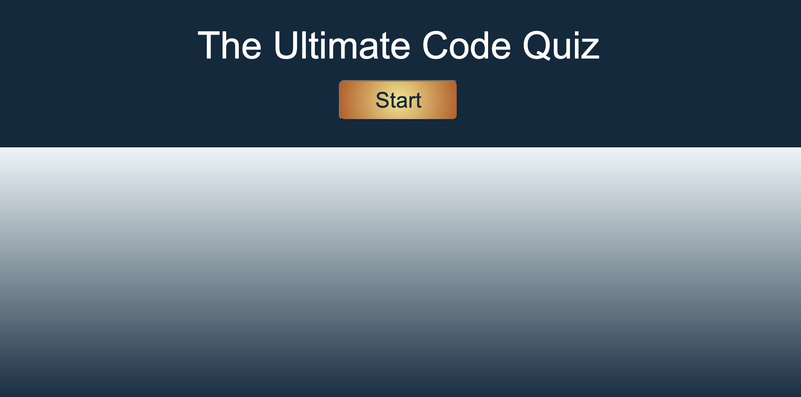
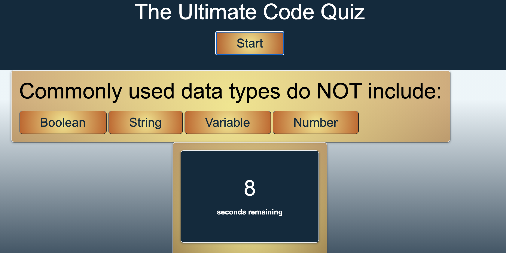
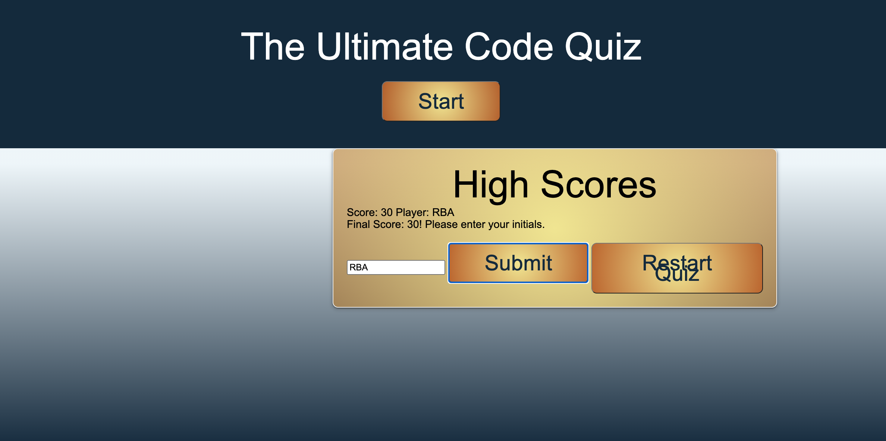

# Code Quiz
a timed coding quiz with multiple-choice questions

## Table of Contents

1. [Description](#description)
2. [Instructions](#instructions)
3. [Usage](#usage)
4. [Contributing](#contributers)
5. [License](#license)

### Description
A timed coding quiz with multiple-choice questions, powered by HTML, CSS, and JavaScript.

### Instructions
To install from GitHub, follow these steps:
1. Click on this link.
2. Answer the questions as presented.
3. Enter your initals to record your score.
4. Hit 'Restart Quiz' to play again!

### Usage
Take the quiz to test your basic JavaScript knowledge.

**Start of Quiz**

**Taking the Quiz**

**Record Your Score**

[Link to Application](https://rachelamos.github.io/code-quiz/)

### Questions
If you have any other questions, you can reach me:
- via email: rachelamos35@gmail.com
- via GitHub: https://github.com/rachelamos

### License
This project is covered under the [MIT](LICENSE) license.

### Contributers
© Rachel Amos